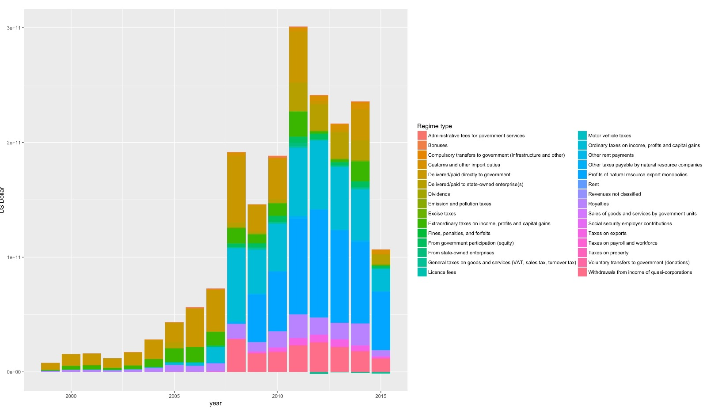
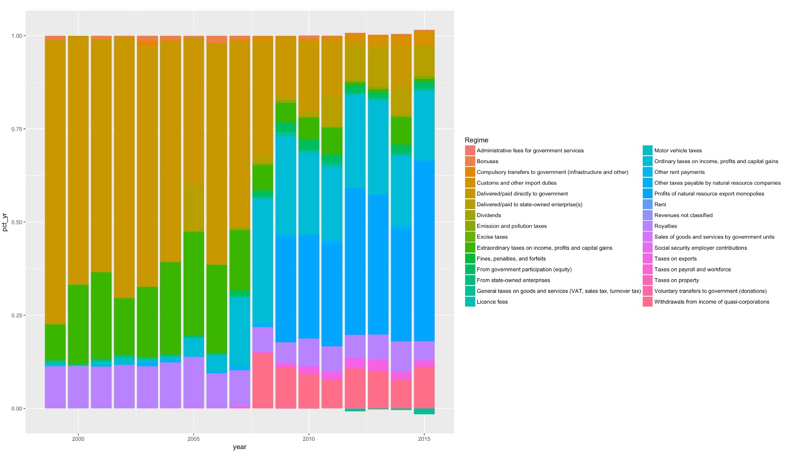

DataDive2017
========================================================
author: Team 2: Dana, Eric, Jon, Maliha, Mikael & Nathan 

date: November 18th, 2017
autosize: true

Research Topic: Revenue Collection in the Extractive Industry
========================================================
Question- Is there evidence that certain types of revenue collection regimes respond better to changes in commodity markets than others? Are any revenue collection regimes less effective at capturing the maximum amount of revenue in price/production upturns and downturns? 

Defining Our Approach
========================================================
- We wanted to examine how commodity prices, commodity production, and exports in EITI membership countries would influence the amount of money collected under different revenue collection regimes (more on these in a minute).

- In order to examine the effect of these different revenue collection regimes, we wanted to create a ratio variable that measures how well each country captures tax revenue based on their natural resource production.

What's a Revenue Collection Regimes?
========================================================
- According to the National Resource Governance Institute (NRGI), a fiscal regime is a set of tools that determines how the revenues from oil and mining projects are shared between the government and companies.
- Variety of fiscal tools governments use to create a fiscal regime: royalties, taxes, production sharing, bonuses, etc.
- Which fiscal tools a government uses depends on when the state wants the revenues, how to share the investment, how to respond to changes in profitability and how to promote new investments

Example of Revenue Flows in Tax and Royalty System
========================================================

Revenue Collection Over Time
========================================================

The Data
========================================================
- Dataset 3 includes info from EITI initiatives. Key variables were country, year, type of revenue stream, tax regime and how much they collected (in USD).
- Cleaned up and organized: combined EITI data with petroleum and mineral price indexes, export data and production information.

The Data, continued
========================================================
- Limitations/issues in the data: confusing/negative values, government changing and tax regimes changing year to year, regime utilization is not uniform throughout time. EITI data not split by commodity, rough approximations of commodities for these groups; minerals a lot of different things so harder to separate (reality in this sector).
- Creation of additional variables: in order to address our question, we created a variable to represent tax revenue to value of the resource produced in a given year (product of price and production).

Revenue Ratio by Country Over Time
========================================================

Revenue Ratio by Country Over Time
========================================================

Breakdown of Agencies in Norway
========================================================

Breakdown of Regimes in Norway (as Percent Total)
========================================================

Revenue Breakdown (in US dollars) per Regime in Norway
========================================================

Breakdown of Agencies in Iraq
========================================================

Breakdown of Regimes in Iraq
========================================================

Revenue Breakdown (in US dollars) per Regime in Iraq
========================================================

Breakdown of Regimes in Yemen
========================================================

Revenue Breakdown (in US dollars) per Regime in Yemen
========================================================

Breakdown of Regimes in Nigeria
========================================================

Revenue Breakdown (in US dollars) per Regime in Nigeria
========================================================

Breakdown of Regimes in Kazakhstan
========================================================

Revenue Breakdown (in US dollars) per Regime in Kazakhstan
========================================================

Total Revenue Collection by Regime
========================================================

Percent Revenue Collection by Regime
========================================================

